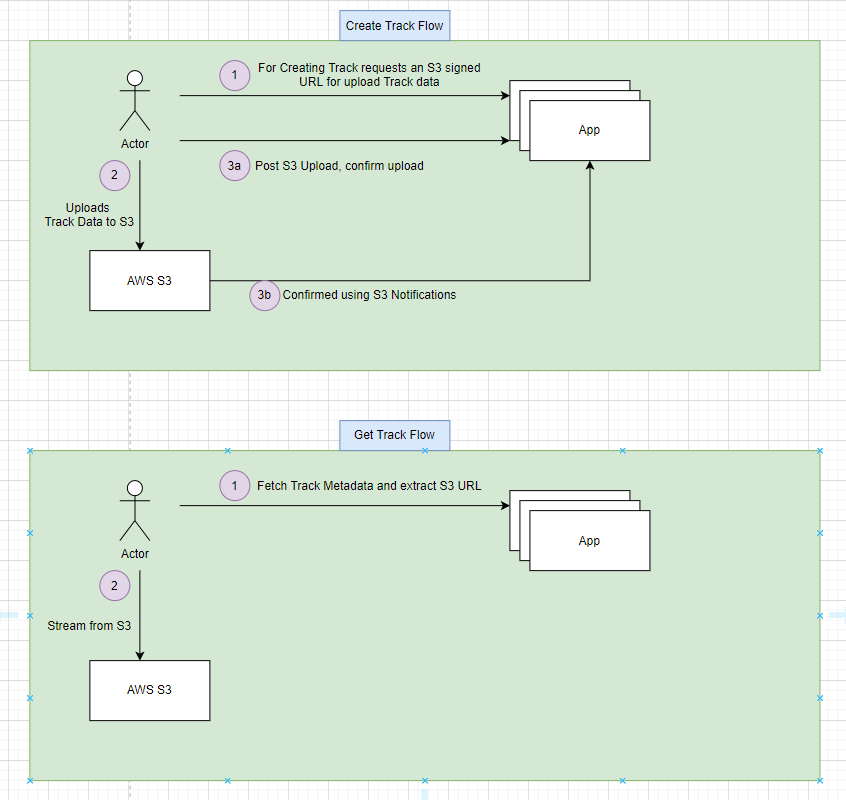
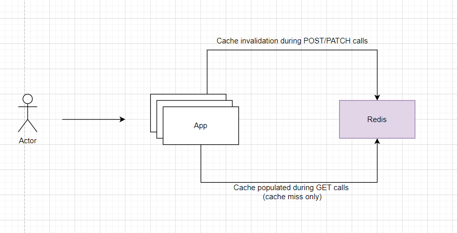
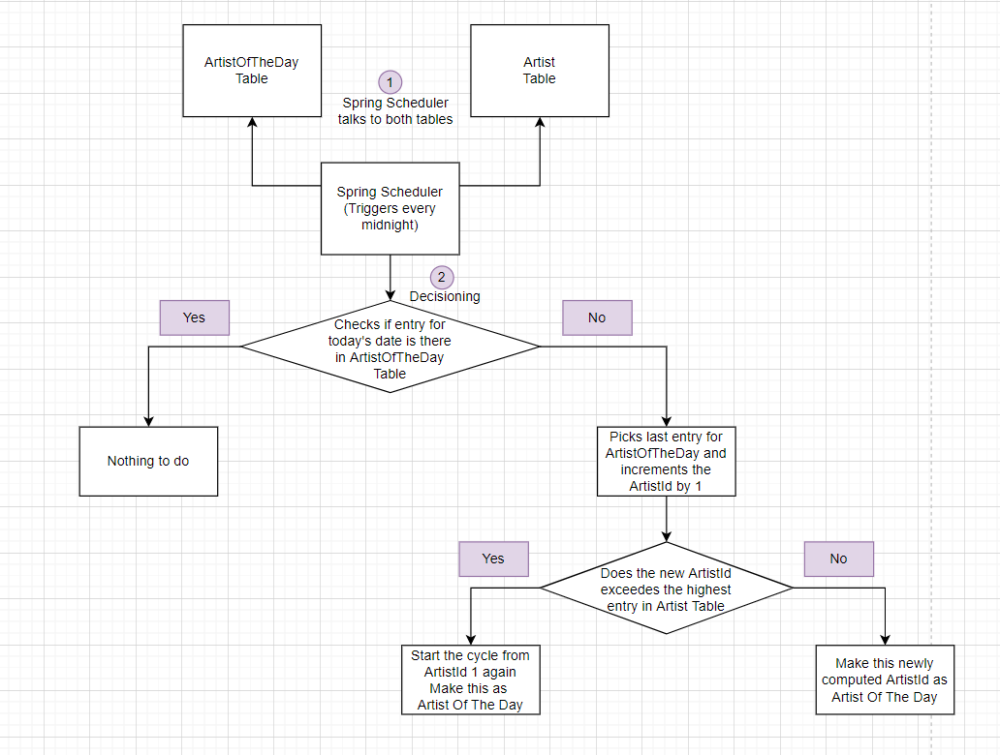

# Music Catalogue App

---

### Before we start

- Postman collection for using the app is located inside `assets` folder
- Data Model used by the app is located inside `assets` folder
- There are some design flows inside `assets` folder
- Swagger can be accessed at
```
http://localhost:9080/music-catalogue/swagger-ui/index.html
```

### API included
Fine Grained APIs:

- GET Artist Info
- CREATE Artist
- UPDATE Artist Info


- GET Artist Alias Info
- CREATE Artist Alias
- UPDATE Artist Alias Info
- LIST Artist Alias


- GET Track Info
- SEARCH Track using filters (Pagination)
- CREATE Track


- GET Artist of the day


### Other inclusions
- Use of in-memory H2 database for demo
- Package/Folder structuring of classes
- Extensive logging throughout
- Error Handling throughout
- Sample Test cases
- Dockerfile
- Tables having Audit fields like `createdAt`, `createdBy`, `lastModifiedAt`, `lastModifiedBy`

### Intential Non-inclusions
- The APIs included are all fine-grained. We could create a lot of bulk/wrapper APIs, but I've not done it intentionally for now to keep things simple. Example: 
  - `Creating Artist and it's 1st/default alias as part of same POST call`
  - `Adding list of songs for an Artist Alias instead of one song at a time`
  - `... more such combinations`
- AWS S3 Signed URL creation APIs not included
- Spring Security not included to keep things simple
- App can benefit a lot from caching but that cache should not be done inside microservice itself as some other instance of microservice can change the data. It needs to be done in a centralised caching solution
- Indexes need to be created on columns in tables where we query

### Why AWS S3




### Caching Model



### Artist Of The Day



**Consideration**:
- From a small time (few seconds) around 12 midnight, the `GET Artist of The Day` API might show yesterday's Artist, which I think is considerable than returning `No Artist of The Day YET`
- This happens due to the cron scheduler has not yet updated `Artist Of The Day Table`

**Approach thoughts**:
- I had initially thought of a hash based approach but that would break in case new Artists are added
- Therefore went with `ArtistOfTheDay` Table approach

### Error Scenarios
- When Alias is created for an invalid Artist
- When Track is created for an invalid Artist Alias
- Trying to fetch an invalid Artist
- Trying to fetch an invalid Artist Alias
- Trying to fetch an invalid Track

### Error Scenario Response
During invalid scenarios app will return this type of payload
```
{
  "message": <Human Readable Message>
  "code": <Unique Enum code for that specific error to be used when client is a machine>
}
```

### Starting application
- The application is written with Java 21
- The application is gradle based, but it's a gradle wrapper so you don't need to have gradle installed
- `./gradlew clean bootRun`

